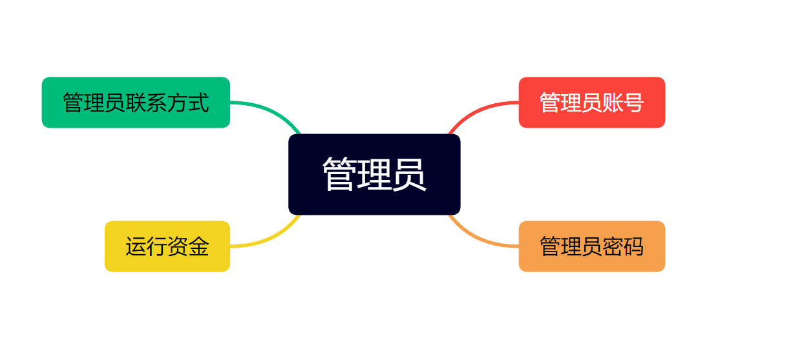
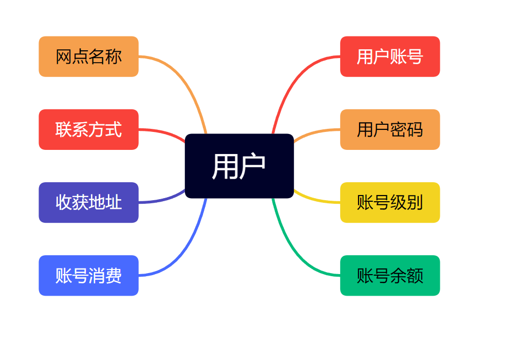
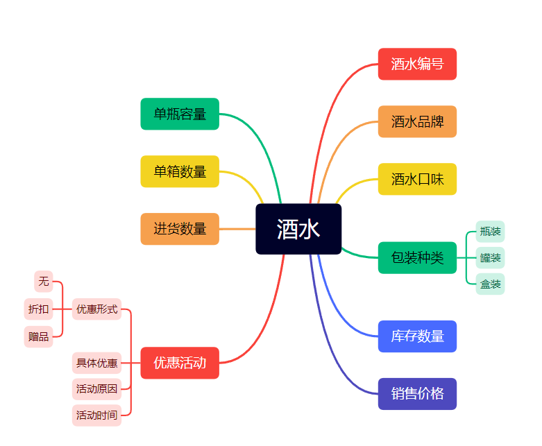
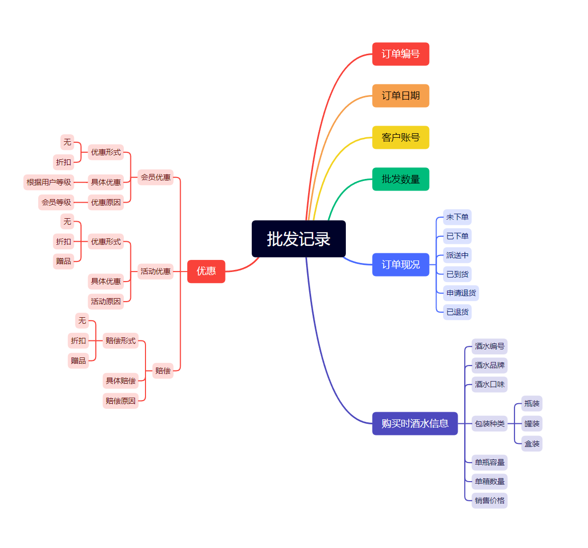
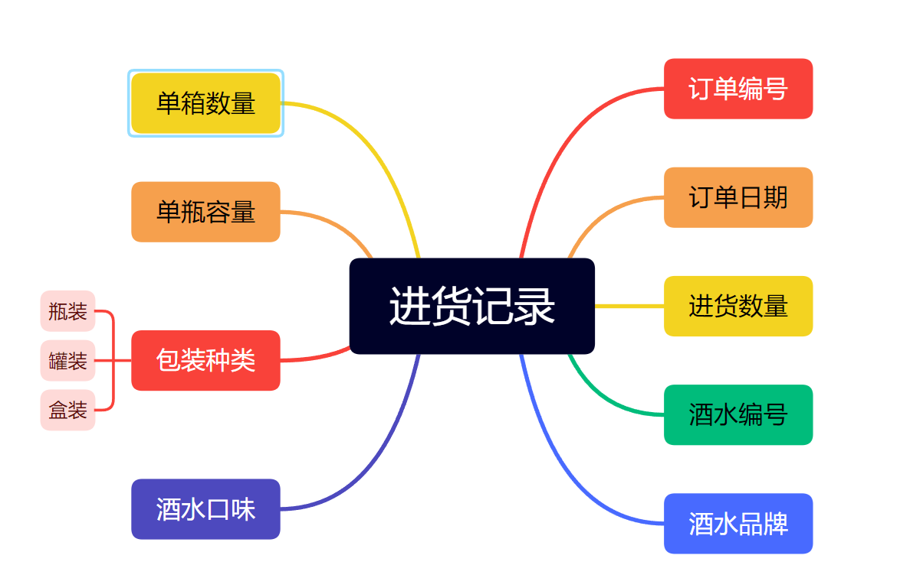
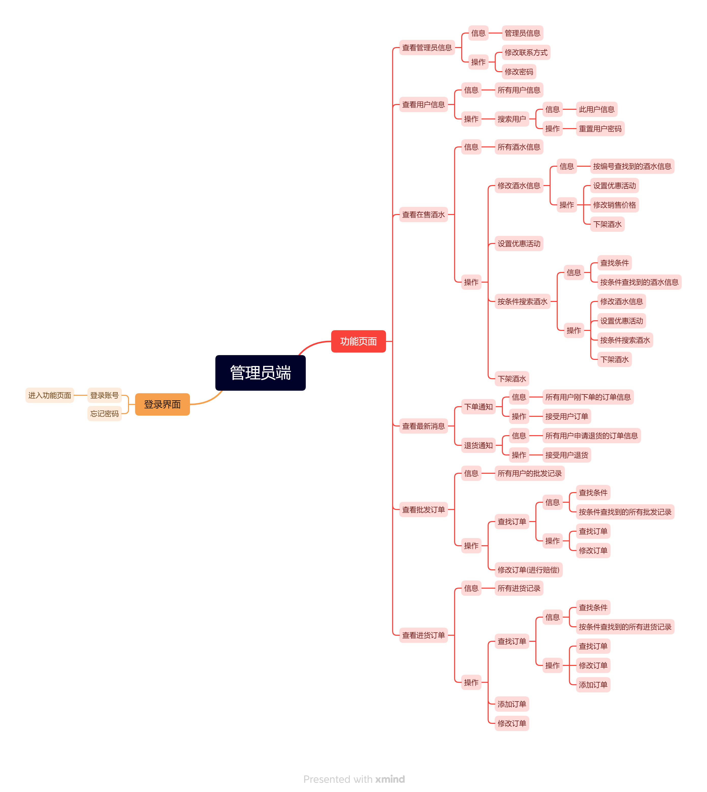
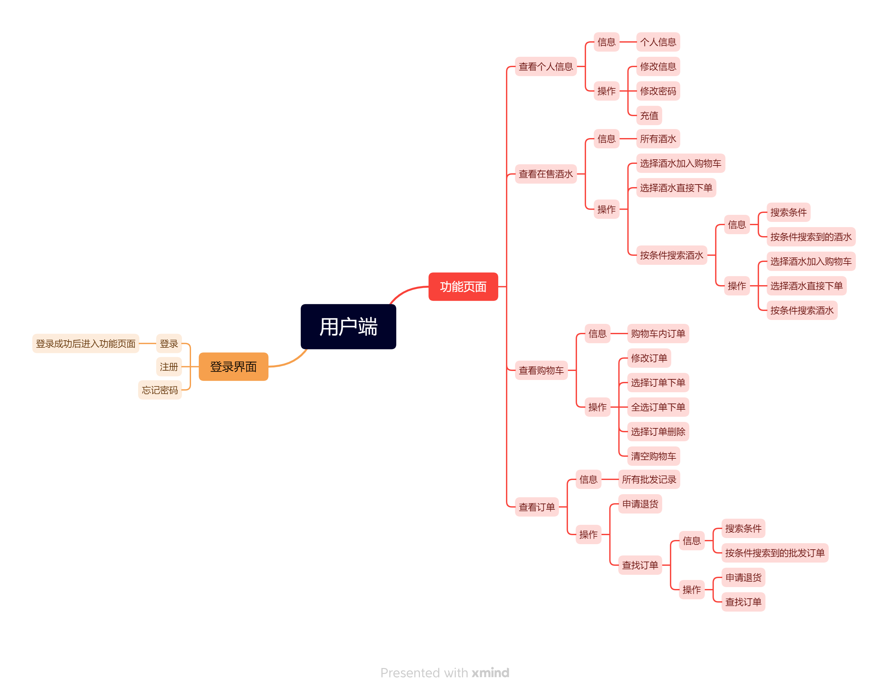

# drink_wholesale_management_system
### 吉林大学2022级程序设计基础课程设计

题目：实现一个酒水批发系统（详见“[程序设计基础课程设计(2022级)20230225最终稿.pdf](https://github.com/wulixinlaimujijia/drink_wholesale_management_system/blob/main/%E7%A8%8B%E5%BA%8F%E8%AE%BE%E8%AE%A1%E5%9F%BA%E7%A1%80%E8%AF%BE%E7%A8%8B%E8%AE%BE%E8%AE%A1(2022%E7%BA%A7)20230225%E6%9C%80%E7%BB%88%E7%A8%BF.pdf)”）

系统设计：详见“[system_design](https://github.com/wulixinlaimujijia/drink_wholesale_management_system/tree/e70e648017a2dc31221e9d2996598ce4e577f67d/system_design)”

## 系统概述
### 基本结构体
#### 管理员结构体

#### 用户结构体

#### 酒水信息结构体

#### 批发记录结构体

#### 进货记录结构体

### 基本功能
#### 管理员端

#### 用户端
